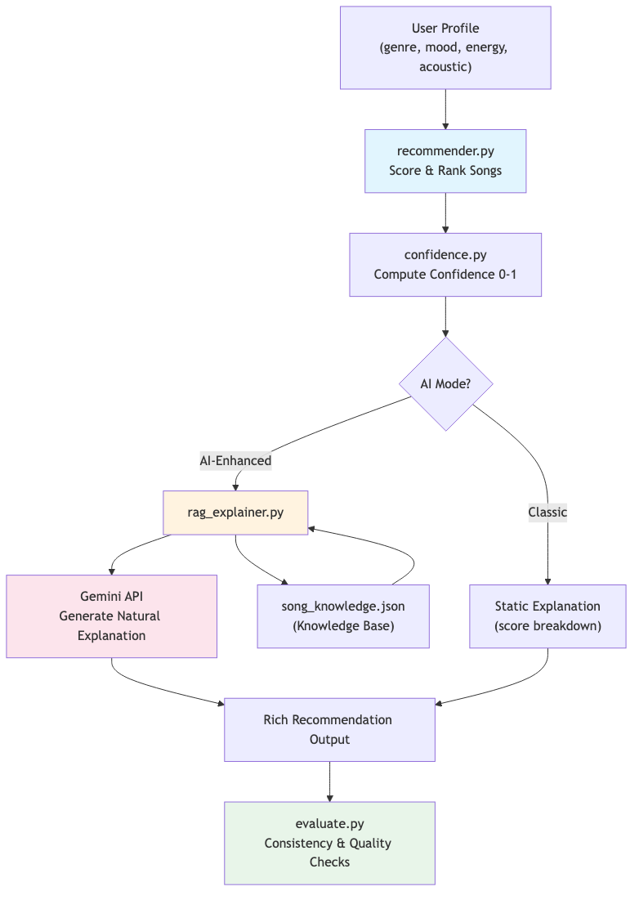

# VibeFinder 2.0 - Applied AI Music Recommender System

## Base Project

This project extends **VibeFinder 1.0** from Module 3 (Music Recommender Simulation). The original system was a content-based song recommender that scored songs against user taste profiles using weighted genre, mood, energy, and acousticness matching, then returned top-ranked results with static score breakdowns. It used a 10-song catalog and 3 hardcoded user profiles.

## Project Summary

**VibeFinder 2.0** evolves the original recommender into a full applied AI system by adding:

- **RAG-powered explanations** - Retrieves rich song context from a knowledge base and uses Google Gemini to generate natural-language recommendation explanations
- **Confidence scoring** - Each recommendation includes a 0-1 confidence score indicating how well-supported the match is across multiple dimensions
- **Expanded catalog** - 30 songs across 13 genres (up from 10 songs across 7 genres)
- **Evaluation harness** - Automated checks for consistency, score distribution, confidence calibration, explanation quality, and knowledge base coverage

## Architecture Overview



**Data flow:** User profile -> `recommender.py` (score & rank) -> `confidence.py` (compute confidence) -> mode selection: Classic returns static score breakdowns, AI-Enhanced retrieves from `song_knowledge.json` and calls Gemini API for natural explanations -> `evaluate.py` runs automated quality checks.

## Setup Instructions

### 1. Clone and create virtual environment

```bash
git clone https://github.com/MatthewOscar/applied-ai-system-project.git
cd applied-ai-system-project
python3 -m venv .venv
source .venv/bin/activate      # Mac/Linux
# .venv\Scripts\activate       # Windows
```

### 2. Install dependencies

```bash
pip install -r requirements.txt
```

### 3. Configure API key (optional, for AI-Enhanced mode)

```bash
cp .env.example .env
# Edit .env and add your GEMINI_API_KEY
```

The system works without an API key -- it falls back to static explanations in Classic mode.

### 4. Run the system

```bash
python -m src.main
```

Select mode 1 (Classic) or mode 2 (AI-Enhanced) when prompted.

### 5. Run tests

```bash
pytest tests/ -v
```

### 6. Run evaluation

```bash
python evaluate.py
```

## Sample Interactions

### Classic Mode

```
Profile: Pop Happy Listener
Preferences: {'genre': 'pop', 'mood': 'happy', 'energy': 0.8}

Top recommendations:

  1. Sunrise City by Neon Echo - Score: 3.98
     Because: Genre match (pop): +2.0; Mood match (happy): +1.0; Energy similarity: +0.98

  2. Gym Hero by Max Pulse - Score: 2.87
     Because: Genre match (pop): +2.0; Energy similarity: +0.87

  3. Rooftop Lights by Indigo Parade - Score: 2.96
     Because: Mood match (happy): +1.0; Energy similarity: +0.96
```

### AI-Enhanced Mode

```
Profile: Pop Happy Listener
Preferences: {'genre': 'pop', 'mood': 'happy', 'energy': 0.8}

Top recommendations:

  1. Sunrise City by Neon Echo - Score: 3.98 | Confidence: High (85%)
     Sunrise City is an excellent match for your pop/happy preferences -- its
     shimmering synths and feel-good energy closely align with your target. Think
     of it as the musical equivalent of a sunny morning drive with CHVRCHES vibes.

  2. Gym Hero by Max Pulse - Score: 2.87 | Confidence: Medium (60%)
     While Gym Hero matches your pop genre preference, its intense mood differs
     from your happy target. However, its high energy level is close to what
     you're looking for, making it a solid workout companion.
```

### Evaluation Report

```
VIBEFINDER 2.0 - EVALUATION REPORT
============================================================
  [PASS] Consistency: 5 passed, 0 failed
  [PASS] Score Distribution: 5 passed, 0 failed
  [PASS] Confidence Calibration: 5 passed, 0 failed
  [PASS] Explanation Quality: 15 passed, 0 failed
  [PASS] Knowledge Base Coverage: 30 passed, 0 failed
------------------------------------------------------------
  TOTAL: 60/60 checks passed
  All checks passed!
```

## Design Decisions

- **Why RAG over pure generation:** Grounding Gemini's explanations in a knowledge base (song descriptions, similar artists, vibe tags) prevents hallucination and produces more specific, accurate explanations.
- **Why confidence scoring:** The recommendation score ranks songs, but confidence (0-1) tells users how *certain* the system is. A song can rank #1 with medium confidence if it only matches on genre + energy but misses mood.
- **Why Gemini 2.5 Flash:** Cost-effective, fast, and sufficient quality for short 2-3 sentence explanations. Matches the pattern used in our Module 4 DocuBot project.
- **Graceful degradation:** The system works fully without an API key. Classic mode uses static explanations; AI-Enhanced mode falls back to static if the API is unavailable. This ensures reproducibility.
- **Expanded catalog:** 30 songs across 13 genres addresses the original bias toward lofi/chill and provides more meaningful recommendation variety.

## Testing Summary

- **9 unit tests passing** (2 original + 3 confidence + 4 RAG explainer)
- **60/60 evaluation checks passing** across 5 categories
- Confidence scores averaged 0.6-0.85 for genre-matched songs; edge cases (no genre match) correctly scored Low confidence
- System handles missing API key gracefully without errors

## Reflection

See [model_card.md](model_card.md) for detailed reflection on AI collaboration, limitations, and system design.

## Demo Walkthrough

*Loom video link: [TBD]*
