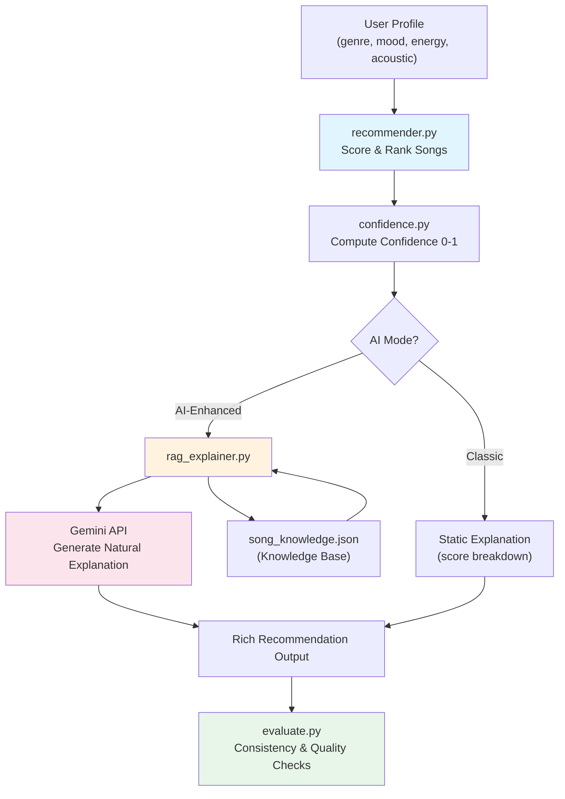

```mermaid
graph TD
    A["User Profile<br/>(genre, mood, energy, acoustic)"] --> B["recommender.py<br/>Score & Rank Songs"]
    B --> C["confidence.py<br/>Compute Confidence 0-1"]
    C --> D{AI Mode?}
    D -->|Classic| E["Static Explanation<br/>(score breakdown)"]
    D -->|AI-Enhanced| F["rag_explainer.py"]
    F --> G["song_knowledge.json<br/>(Knowledge Base)"]
    G --> F
    F --> H["Gemini API<br/>Generate Natural Explanation"]
    H --> I["Rich Recommendation Output"]
    E --> I
    I --> J["evaluate.py<br/>Consistency & Quality Checks"]

    style B fill:#e1f5fe
    style F fill:#fff3e0
    style H fill:#fce4ec
    style J fill:#e8f5e9
```
